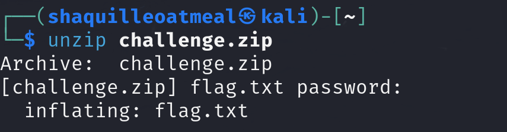

# GreyCTF-Writeups

| Team | Global ranking | Local ranking |
| ----------- | ----------- | ----------- |
| **brandon** | **80th place** | **36th place**|

## Welcome👋😁

Hint: Cashhat the Ripper is the clue to using [John the Ripper](https://en.wikipedia.org/wiki/John_the_Ripper)
#### This is how John works by default:
- recognize the hash type of the current hash
- generate hashes on the fly for all the passwords in the dictionary
- stop when a generated hash matches the current hash.

#### Installation for **John the Ripper**:
- Comes pre-installed with Kali Linux
- Run ```john``` to see if it is installed
- Run ``` apt install John ``` for installation

## Steps to solve:
1. Use ```cd``` to change the current directory to the same directory as challenge.zip
2. Run ```zip2john challenge.zip > hash.txt``` to create a hash file of the password protected file
3. Run ```john hash.txt``` to start the bruteforce password cracking against the hash file

4. Wait for a while until it provides password

5. Run ```unzip challenge.zip``` using the password

6. Run ```cat flag.txt``` to open the file

7. Flag found! 😁👍

### Flag → ``` flag{W34k_P4ssw0rds_St4Nd_n0_Ch4nc3} ```  
### 😁👍